---
## Front matter
title: "Отчёт по лабораторной работе №3"
subtitle: "Дисциплина: Архитектура компьютера"
author: "Ищенко Ирина Олеговна"

## Generic otions
lang: ru-RU
toc-title: "Содержание"

## Bibliography
bibliography: bib/cite.bib
csl: pandoc/csl/gost-r-7-0-5-2008-numeric.csl

## Pdf output format
toc: true # Table of contents
toc-depth: 2
lof: true # List of figures
lot: true # List of tables
fontsize: 12pt
linestretch: 1.5
papersize: a4
documentclass: scrreprt
## I18n polyglossia
polyglossia-lang:
  name: russian
  options:
	- spelling=modern
	- babelshorthands=true
polyglossia-otherlangs:
  name: english
## I18n babel
babel-lang: russian
babel-otherlangs: english
## Fonts
mainfont: PT Serif
romanfont: PT Serif
sansfont: PT Sans
monofont: PT Mono
mainfontoptions: Ligatures=TeX
romanfontoptions: Ligatures=TeX
sansfontoptions: Ligatures=TeX,Scale=MatchLowercase
monofontoptions: Scale=MatchLowercase,Scale=0.9
## Biblatex
biblatex: true
biblio-style: "gost-numeric"
biblatexoptions:
  - parentracker=true
  - backend=biber
  - hyperref=auto
  - language=auto
  - autolang=other*
  - citestyle=gost-numeric
## Pandoc-crossref LaTeX customization
figureTitle: "Рис."
tableTitle: "Таблица"
listingTitle: "Листинг"
lofTitle: "Список иллюстраций"
lotTitle: "Список таблиц"
lolTitle: "Листинги"
## Misc options
indent: true
header-includes:
  - \usepackage{indentfirst}
  - \usepackage{float} # keep figures where there are in the text
  - \floatplacement{figure}{H} # keep figures where there are in the text
---

# Цель работы

Целью работы является изучить идеологию и применение средств контроля
версий. Приобрести практические навыки по работе с системой git. 

# Выполнение лабораторной работы

Создаём учётную запись на сайте https://github.com/ и заполняем основную информацию (рис. [-@fig:001]). 

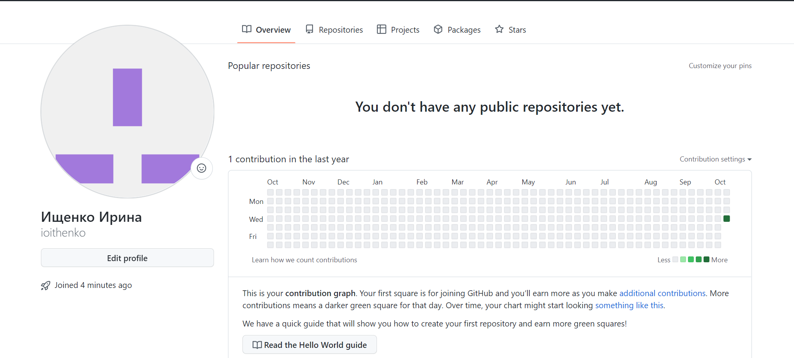{ #fig:001 width=70% }

Сделаем предварительную конфигурацию git. Откроем терминал и введем следующие команды, указав свое имя и email, указанные при создании учётной записи (рис. [-@fig:002]).
 
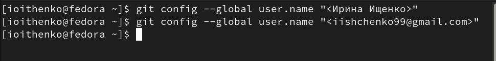{ #fig:002 width=70% }

Настроим utf-8 в выводе сообщений git (рис. [-@fig:003]). 

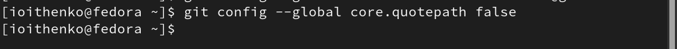{ #fig:003 width=70% }

Зададим имя начальной ветки (рис. [-@fig:004]).
 
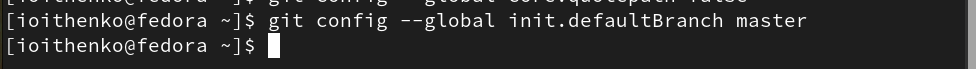{ #fig:004 width=70% } 

Параметры autocrlf и safecrlf (рис. [-@fig:005]).

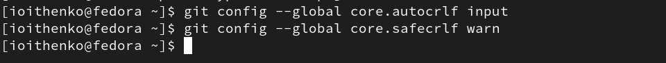{ #fig:005 width=70% }

Cгенерируем пару ключей для последующей идентификации пользователя на сервере репозиториев (рис. [-@fig:006]).

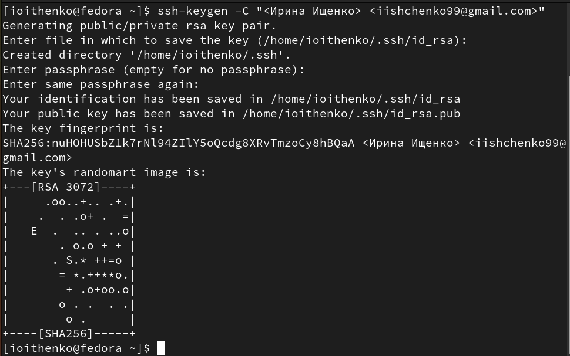{ #fig:006 width=70% }

Копируем из локальной консоли ключ в буфер обмена (рис. [-@fig:007]).

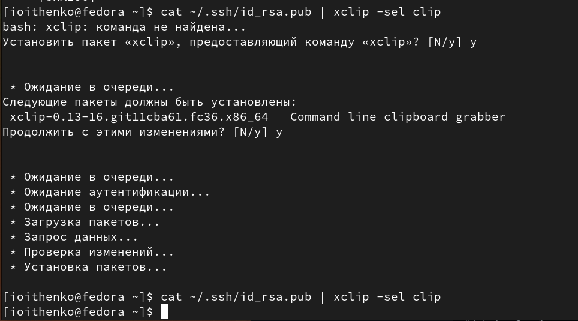{ #fig:007 width=70% } 

Далее загружаем сгенерированный ключ на сайт (рис. [-@fig:008]).

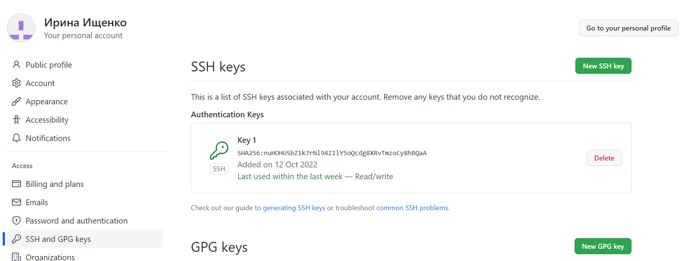{ #fig:008 width=70% } 

Создадим каталог для предмета «Архитектура компьютера» через терминал (рис. [-@fig:009]).
 
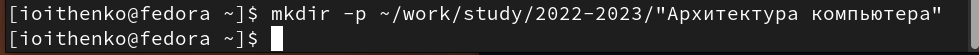{ #fig:009 width=70% } 

Создадим репозиторий на основе шаблона через web-интерфейс github (рис. [-@fig:0010]), (рис. [-@fig:0011]). 

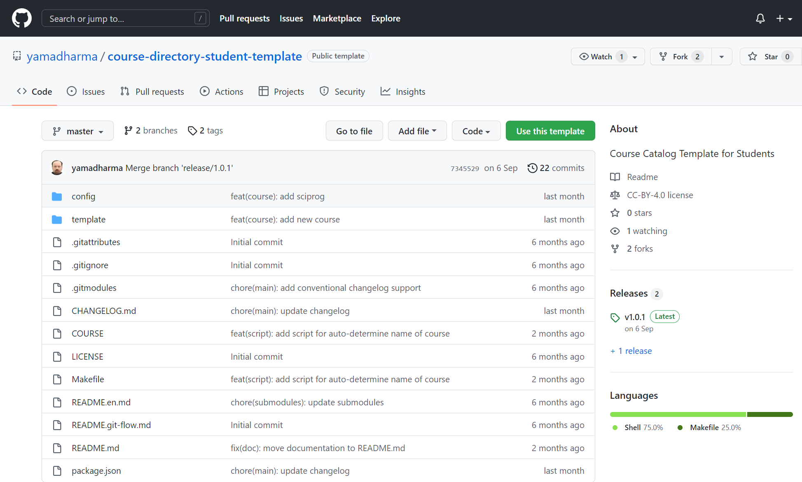{ #fig:0010 width=70% }

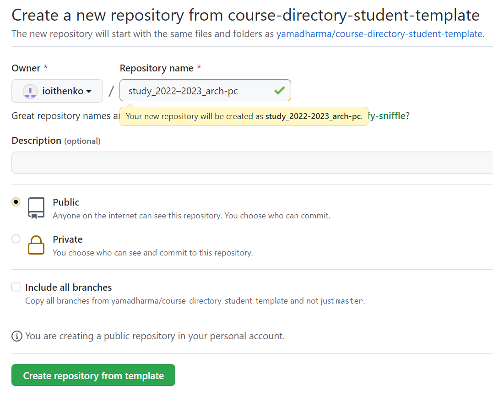{ #fig:0011 width=70% } 

Затем откроем терминал, перейдем в каталог курса и клонируем созданный репозиторий (рис. [-@fig:0012]). 

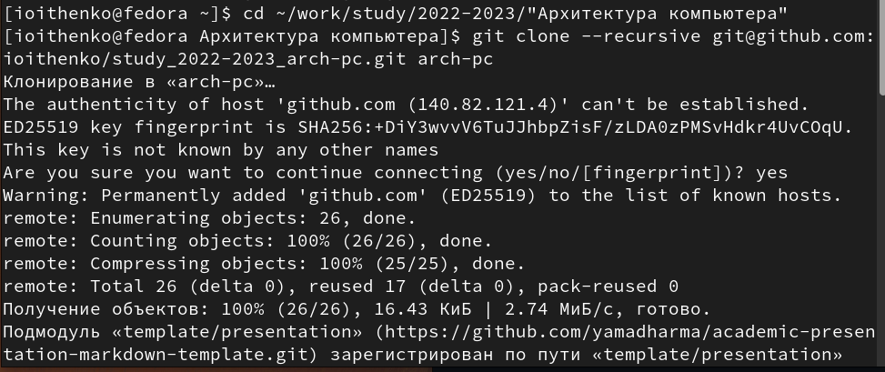{ #fig:0012 width=70% } 

Перейдем в каталог курса, удалим лишние файлы, создадим необходимые каталоги и отправим файлы на сервер (рис. [-@fig:0013]), (рис. [-@fig:0014]), (рис. [-@fig:0015]).

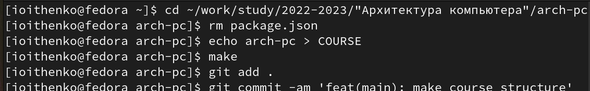{ #fig:0013 width=70% } 

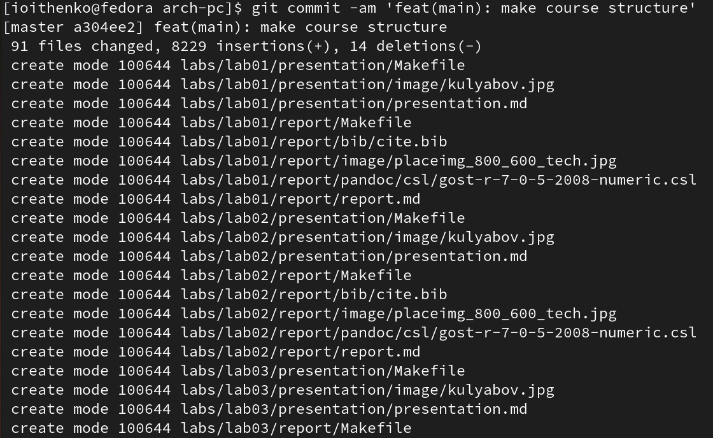{ #fig:0014 width=70% } 

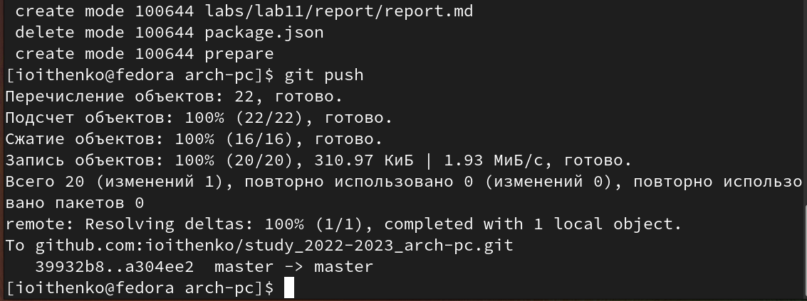{ #fig:0015 width=70% } 

Проверим правильность создания иерархии рабочего пространства в локальном репозитории и на странице github (рис. [-@fig:0016]), (рис. [-@fig:0017]), (рис. [-@fig:0018]).
 
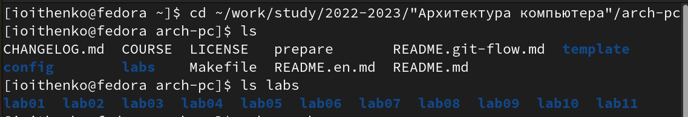{ #fig:0016 width=70% } 

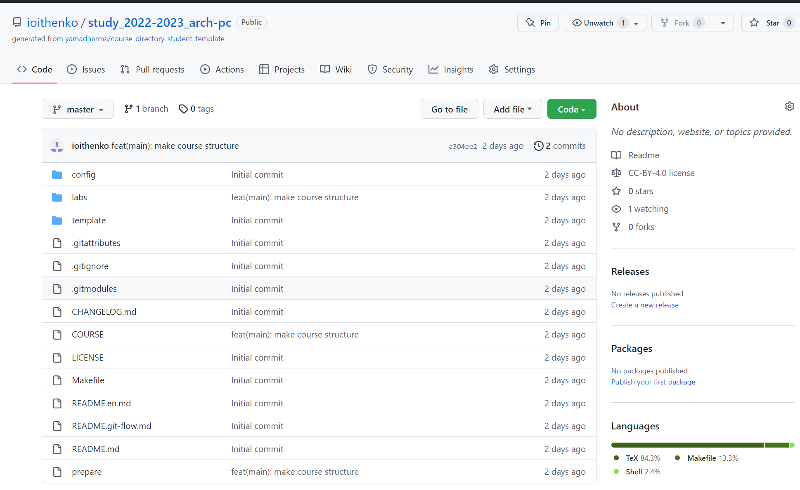{ #fig:0017 width=70% }

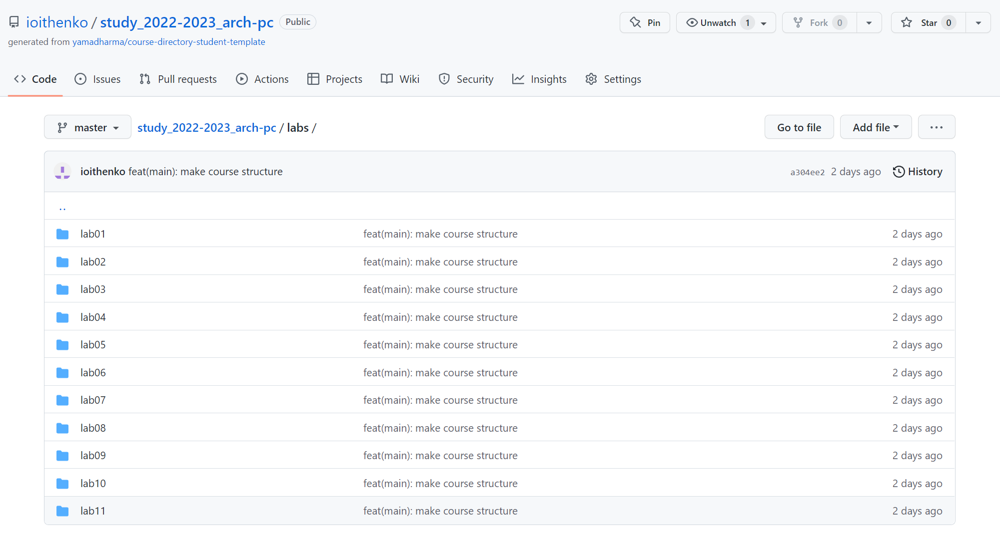{ #fig:0018 width=70% } 

# Выполнение заданий для самостоятельной работы

Загружаем на github первую, вторую и третью лабораторные работы. В отчете прикреплены скриншоты к загрузке первых двух работ (рис. [-@fig:0019]).
 
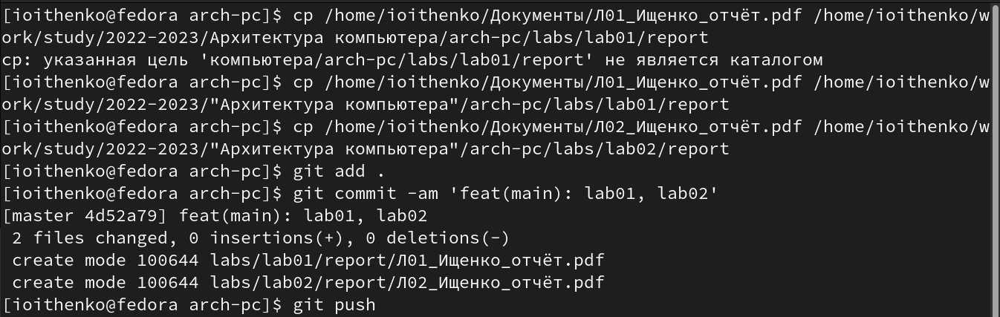{ #fig:0019 width=70% } 

# Выводы

В ходе выполнения данной лабораторной работы я создала свой репозиторий на github и приобрела базовые навыки по работе с системой git. Также я загрузила файлы отчетов своих лабораторных работ в созданный репозиторий.

::: {#refs}
:::
