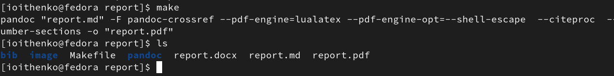
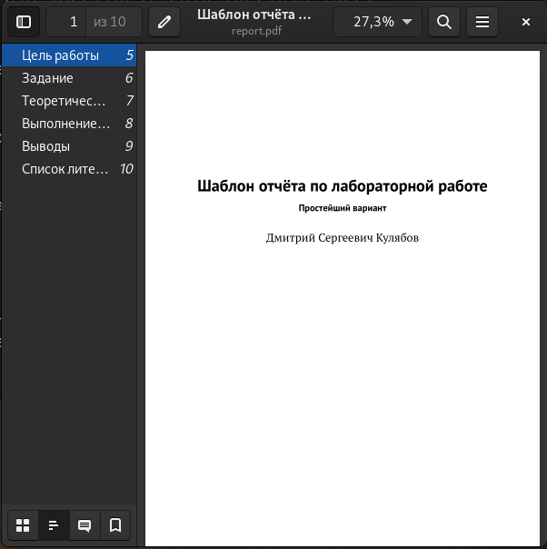

---
## Front matter
title: "Отчёт по лабораторной работе №4"
subtitle: "Дисциплина: Архитектура компьютера"
author: "Ищенко Ирина Олеговна"

## Generic otions
lang: ru-RU
toc-title: "Содержание"

## Bibliography
bibliography: bib/cite.bib
csl: pandoc/csl/gost-r-7-0-5-2008-numeric.csl

## Pdf output format
toc: true # Table of contents
toc-depth: 2
lof: true # List of figures
lot: true # List of tables
fontsize: 12pt
linestretch: 1.5
papersize: a4
documentclass: scrreprt
## I18n polyglossia
polyglossia-lang:
  name: russian
  options:
	- spelling=modern
	- babelshorthands=true
polyglossia-otherlangs:
  name: english
## I18n babel
babel-lang: russian
babel-otherlangs: english
## Fonts
mainfont: PT Serif
romanfont: PT Serif
sansfont: PT Sans
monofont: PT Mono
mainfontoptions: Ligatures=TeX
romanfontoptions: Ligatures=TeX
sansfontoptions: Ligatures=TeX,Scale=MatchLowercase
monofontoptions: Scale=MatchLowercase,Scale=0.9
## Biblatex
biblatex: true
biblio-style: "gost-numeric"
biblatexoptions:
  - parentracker=true
  - backend=biber
  - hyperref=auto
  - language=auto
  - autolang=other*
  - citestyle=gost-numeric
## Pandoc-crossref LaTeX customization
figureTitle: "Рис."
tableTitle: "Таблица"
listingTitle: "Листинг"
lofTitle: "Список иллюстраций"
lotTitle: "Список таблиц"
lolTitle: "Листинги"
## Misc options
indent: true
header-includes:
  - \usepackage{indentfirst}
  - \usepackage{float} # keep figures where there are in the text
  - \floatplacement{figure}{H} # keep figures where there are in the text
---

# Цель работы

Целью работы является освоение процедуры оформления отчетов с помощью
легковесного языка разметки Markdown.

# Выполнение лабораторной работы

Для начала необходимо установить texlive. Скачиваем архив по ссылке с github в папку tmp (рис. [-@fig:001]), распаковываем его (рис. [-@fig:002]), заходим в получившийся каталог и запускаем скрипт install-tl-20221023 (рис. [-@fig:003]). Добавляем /usr/local/texlive/2022/bin/x86_64-linux в PATH (рис.[-@fig:004]), данную команду нужно дублировать перед использоваеи команды make.

{ #fig:001 width=70% }

{ #fig:002 width=70% }

{ #fig:003 width=70% }

{ #fig:004 width=70% }

По ссылке скачиваем 18 версию Pandoc (рис. [-@fig:005]) и версию pandoc-crossref, ему соответствующую 3.13 (рис. [-@fig:006]). Распаковываем архивы (рис. [-@fig:007]) и копируем файлы в каталог /usr/local/bin/ (рис. [-@fig:008]). Выполняем проверку с помощью команды ls (рис. [-@fig:009]).

{ #fig:005 width=70% }

{ #fig:006 width=70% }

{ #fig:007 width=70% }

{ #fig:008 width=70% }

{ #fig:009 width=70% }

Открываем терминал и переходим в каталог курса. Обновляем локальный репозиторий с помощью команды git pull. Переходим в каталог с шаблоном отчета для работы №4 (рис. [-@fig:0010]) и компилируем шаблон с помощью команды make (рис. [-@fig:0011]). Проверим корректность выполненных команд и откроем docx и pdf файлы (рис. [-@fig:0012]), (рис. [-@fig:0013]).

{ #fig:0010 width=70% }

{ #fig:0011 width=70% }

{ #fig:0012 width=70% }

{ #fig:0013 width=70% }

Открываем файл report.md c помощью текстового редактора gedit (рис. [-@fig:0014]).

{ #fig:0014 width=70% }

С помощью команды make clean удаляем создавшиеся файлы и проверяем выполнение команды (рис. [-@fig:0015]).

{ #fig:0015 width=70% }

# Выполнение заданий для самостоятельной работы

Оформляем отчет по третьей лабораторной работе. Затем с помощью команды make в каталоге report каталога lab03 компилируем файлы (рис. [-@fig:0016]).

{ #fig:0016 width=70% }

Отчеты в трех форматах прикреплены на github.

# Выводы

В ходе выполнения данной лабораторной работы я научилась оформлять отчетов с помощью легковесного языка разметки Markdown.
С использованием этой разметки мной были написаны отчеты для третьей и четвертой лабораторных работ.

::: {#refs}
:::
