---
## Front matter
title: "Отчёт по лабораторной работе №5"
subtitle: "Дисциплина: Архитектура компьютера"
author: "Ищенко Ирина Олеговна"

## Generic otions
lang: ru-RU
toc-title: "Содержание"

## Bibliography
bibliography: bib/cite.bib
csl: pandoc/csl/gost-r-7-0-5-2008-numeric.csl

## Pdf output format
toc: true # Table of contents
toc-depth: 2
lof: true # List of figures
lot: true # List of tables
fontsize: 12pt
linestretch: 1.5
papersize: a4
documentclass: scrreprt
## I18n polyglossia
polyglossia-lang:
  name: russian
  options:
	- spelling=modern
	- babelshorthands=true
polyglossia-otherlangs:
  name: english
## I18n babel
babel-lang: russian
babel-otherlangs: english
## Fonts
mainfont: PT Serif
romanfont: PT Serif
sansfont: PT Sans
monofont: PT Mono
mainfontoptions: Ligatures=TeX
romanfontoptions: Ligatures=TeX
sansfontoptions: Ligatures=TeX,Scale=MatchLowercase
monofontoptions: Scale=MatchLowercase,Scale=0.9
## Biblatex
biblatex: true
biblio-style: "gost-numeric"
biblatexoptions:
  - parentracker=true
  - backend=biber
  - hyperref=auto
  - language=auto
  - autolang=other*
  - citestyle=gost-numeric
## Pandoc-crossref LaTeX customization
figureTitle: "Рис."
tableTitle: "Таблица"
listingTitle: "Листинг"
lofTitle: "Список иллюстраций"
lotTitle: "Список таблиц"
lolTitle: "Листинги"
## Misc options
indent: true
header-includes:
  - \usepackage{indentfirst}
  - \usepackage{float} # keep figures where there are in the text
  - \floatplacement{figure}{H} # keep figures where there are in the text
---

# Цель работы

Освоение процедуры компиляции и сборки программ, написанных на ассемблере NASM.

# Выполнение лабораторной работы

Создаем каталог для работы с программами на языке ассемблера NASM и переходим в него (рис. [-@fig:001]).

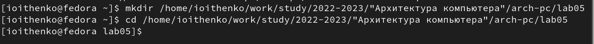{ #fig:001 width=70% }

Создаем текстовый файл с именем hello.asm и открываем его в текстовом редакторе (рис. [-@fig:002]). Вводим текст (рис. [-@fig:003]).

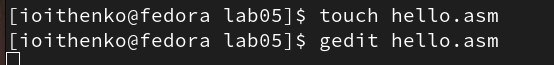{ #fig:002 width=70% }

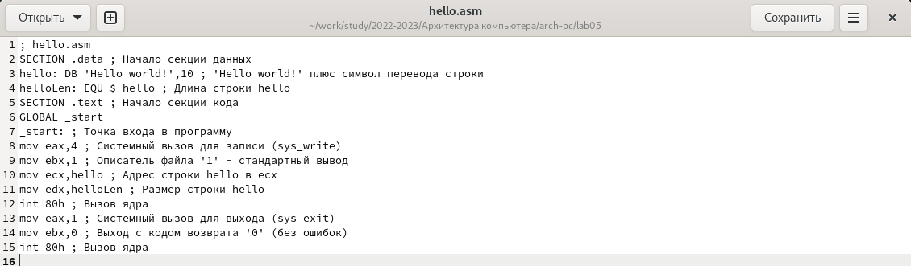{ #fig:003 width=80% }

Преобразуем текст программы в объектный код и проверяем, создался ли объектный файл (рис. [-@fig:004]). Созданный файл имеет имя hello.o.

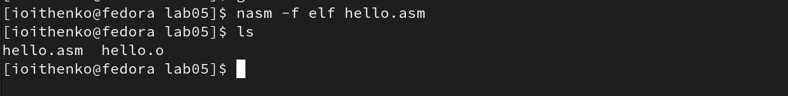{ #fig:004 width=80% }

С помощью команды *nasm -o obj.o -f elf -g -l list.lst hello.asm* скомпилируем исходный файл hello.asm в obj.o, также будет создан файл листинга list.lst. Проверим выполнение команды (рис. [-@fig:005]).

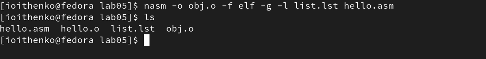{ #fig:005 width=70% }

Создадим исполняемый файл hello и проведем проверку командой *ls* (рис. [-@fig:006]).

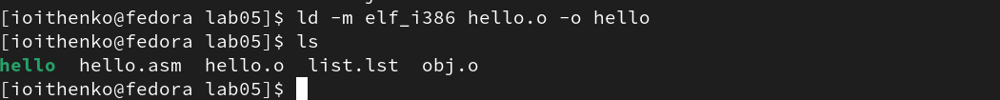{ #fig:006 width=70% }

С помощью команды (рис. [-@fig:007]) создадим исполняемый файл с названием main из объектного файла obj.o.

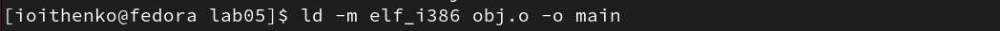{ #fig:007 width=70% }

Запустим исполняемый файл (рис. [-@fig:008]).

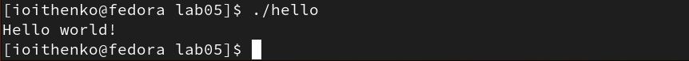{ #fig:008 width=70% }

# Выполнение заданий для самостоятельной работы

С помощью команды *cp* создадим копию файла hello.asm с именем lab5.asm.  В текстовом редакторе внесем изменения в текст программы в файле lab5.asm (рис. [-@fig:009]). Оттранслируем полученный текст программы lab5.asm в объектный файл. Выполним компоновку объектного файла и запустим получившийся исполняемый файл (рис. [-@fig:0010]).

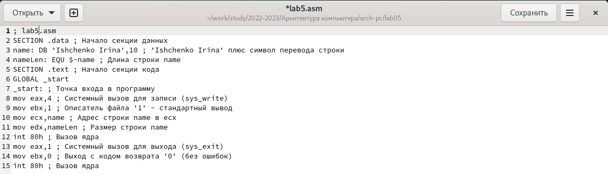{ #fig:009 width=70% }

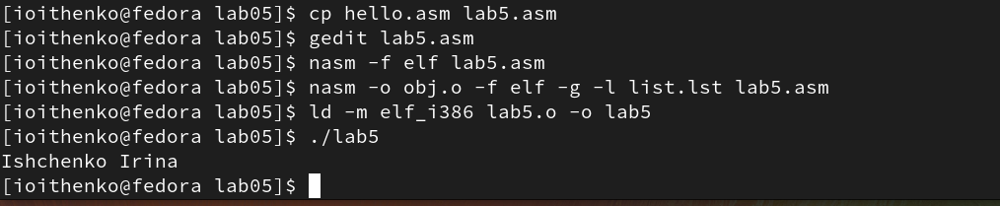{ #fig:0010 width=70% }

Скопируем файлы hello.asm и lab5.asm в локальный репозиторий в соответствующий каталог. Загрузим файлы на Github (рис. [-@fig:0011]).

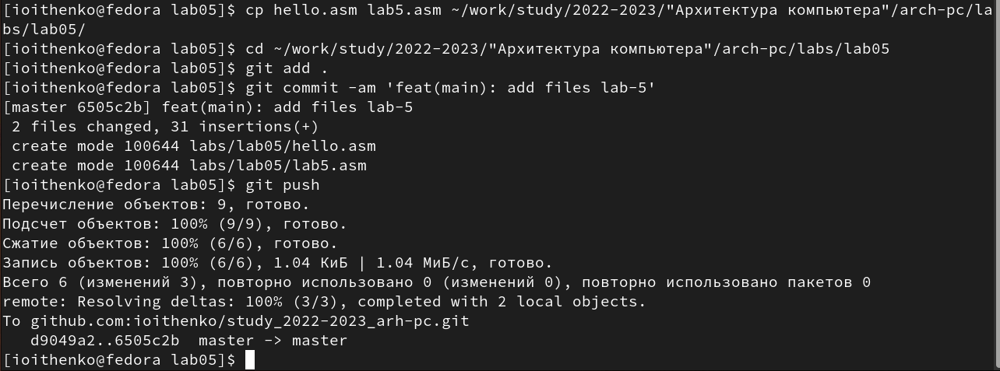{ #fig:0011 width=70% }

# Выводы

В ходе выполнения лабораторной работы я освоила процедуры компиляции и сборки программ, написанных на языке ассемблера NASM.

::: {#refs}
:::
