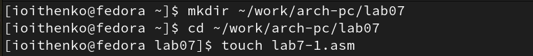
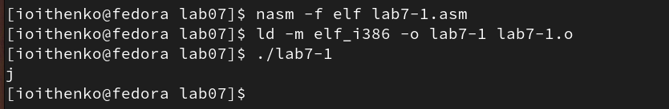
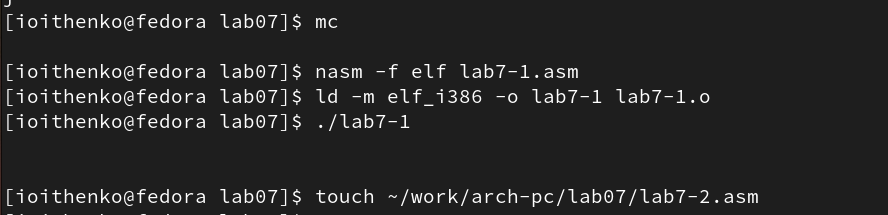
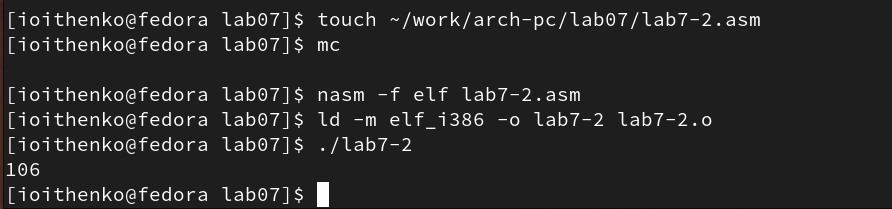
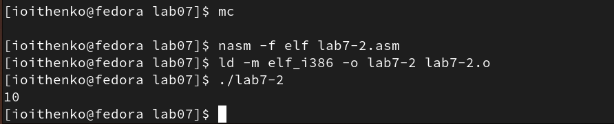
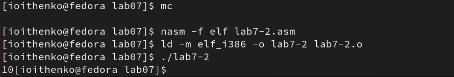
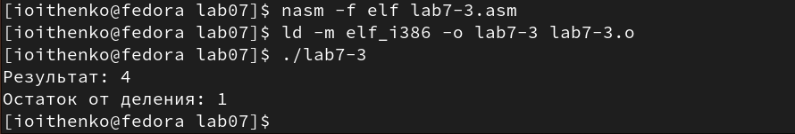
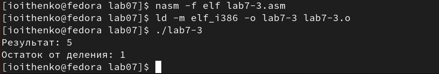
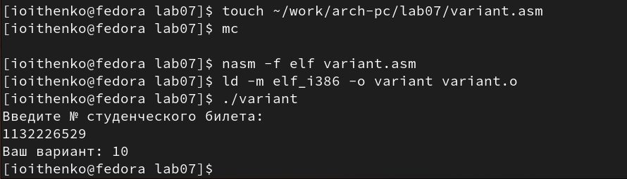
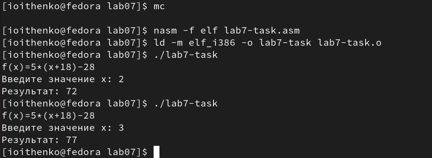

---
## Front matter
title: "Отчёт по лабораторной работе №7"
subtitle: "Дисциплина: Архитектура компьютера"
author: "Ищенко Ирина Олеговна"

## Generic otions
lang: ru-RU
toc-title: "Содержание"

## Bibliography
bibliography: bib/cite.bib
csl: pandoc/csl/gost-r-7-0-5-2008-numeric.csl

## Pdf output format
toc: true # Table of contents
toc-depth: 2
lof: true # List of figures
lot: true # List of tables
fontsize: 12pt
linestretch: 1.5
papersize: a4
documentclass: scrreprt
## I18n polyglossia
polyglossia-lang:
  name: russian
  options:
	- spelling=modern
	- babelshorthands=true
polyglossia-otherlangs:
  name: english
## I18n babel
babel-lang: russian
babel-otherlangs: english
## Fonts
mainfont: PT Serif
romanfont: PT Serif
sansfont: PT Sans
monofont: PT Mono
mainfontoptions: Ligatures=TeX
romanfontoptions: Ligatures=TeX
sansfontoptions: Ligatures=TeX,Scale=MatchLowercase
monofontoptions: Scale=MatchLowercase,Scale=0.9
## Biblatex
biblatex: true
biblio-style: "gost-numeric"
biblatexoptions:
  - parentracker=true
  - backend=biber
  - hyperref=auto
  - language=auto
  - autolang=other*
  - citestyle=gost-numeric
## Pandoc-crossref LaTeX customization
figureTitle: "Рис."
tableTitle: "Таблица"
listingTitle: "Листинг"
lofTitle: "Список иллюстраций"
lotTitle: "Список таблиц"
lolTitle: "Листинги"
## Misc options
indent: true
header-includes:
  - \usepackage{indentfirst}
  - \usepackage{float} # keep figures where there are in the text
  - \floatplacement{figure}{H} # keep figures where there are in the text
---

# Цель работы

Освоение арифметических инструкций языка ассемблера NASM.

# Выполнение лабораторной работы

Создадим каталог для программ лабораторной работы № 7, переходим в
него и создаем файл lab7-1.asm (рис. [-@fig:001]).

{ #fig:001 width=70% }

Введем в файл lab7-1.asm текст программы из листинга 1, создадим исполняемый файл и запустим его (рис. [-@fig:002]).
Листинг 1:

```nasm
%include 'in_out.asm'
SECTION .bss
buf1: RESB 80
SECTION .text
GLOBAL _start
_start:
mov eax,'6'
mov ebx,'4'
add eax,ebx
mov [buf1],eax
mov eax,buf1
call sprintLF
call quit
```

{ #fig:002 width=70% }

Далее изменим текст программы и вместо символов запишем в регистры числа. Создадим исполняемый файл и запустим его (рис. [-@fig:003]). Согласно таблице ASCII, коду 10 соответствует символ LF. При выходе на экран этот символ не отображается, так как является переносом на новую строку.

{ #fig:003 width=70% }

Создадим файл lab7-2.asm в каталоге ~/work/arch-pc/lab07 и введем в него
текст программы из листинга 2. Создадим исполняемый файл и запустим его (рис. [-@fig:004]).
Листинг 2:

```nasm
%include 'in_out.asm'
SECTION .text
GLOBAL _start
_start:
mov eax,'6'
mov ebx,'4'
add eax,ebx
call iprintLF
call quit
```

{ #fig:004 width=70% }

Изменим текст программы и вместо символов запишем в регистры числа. Создадим исполняемый файл и запустим его (рис. [-@fig:005]). В результате программа выведет 10.

{ #fig:005 width=70% }

Заменим функцию iprintLF на iprint. Создадим исполняемый файл и запустим его (рис. [-@fig:006]). Функция iprintLF выводит значение с переносом на новую строку в отличие от iprint.

{ #fig:006 width=70% }

Создадим файл lab7-3.asm в каталоге ~/work/arch-pc/lab07 и введем текст программы из листинга 3. Создадим исполняемый файл и запустим его (рис. [-@fig:007]).
Листинг 3:

```nasm
;--------------------------------
; Программа вычисления выражения
;--------------------------------
%include 'in_out.asm' ; подключение внешнего файла
SECTION .data
div: DB 'Результат: ',0
rem: DB 'Остаток от деления: ',0
SECTION .text
GLOBAL _start
_start:
; ---- Вычисление выражения
mov eax,5 ; EAX=5
mov ebx,2 ; EBX=2
mul ebx ; EAX=EAX*EBX
add eax,3 ; EAX=EAX+3
xor edx,edx ; обнуляем EDX для корректной работы div
mov ebx,3 ; EBX=3
div ebx ; EAX=EAX/3, EDX=остаток от деления
mov edi,eax ; запись результата вычисления в 'edi'
; ---- Вывод результата на экран
mov eax,div ; вызов подпрограммы печати
call sprint ; сообщения 'Результат: '
mov eax,edi ; вызов подпрограммы печати значения
call iprintLF ; из 'edi' в виде символов
mov eax,rem ; вызов подпрограммы печати
call sprint ; сообщения 'Остаток от деления: '
mov eax,edx ; вызов подпрограммы печати значения
call iprintLF ; из 'edx' (остаток) в виде символов
call quit ; вызов подпрограммы завершения
```

{ #fig:007 width=70% }

Изменим текст программы для вычисления выражения (4 * 6 + 2)/5, согласно листингу 4. Создадим исполняемый файл и проверим его работу (рис. [-@fig:008]).
Листинг 4:

```nasm
;--------------------------------
; Программа вычисления выражения
;--------------------------------
%include 'in_out.asm' ; подключение внешнего файла
SECTION .data
div: DB 'Результат: ',0
rem: DB 'Остаток от деления: ',0
SECTION .text
GLOBAL _start
_start:
; ---- Вычисление выражения
mov eax,4 ; EAX=4
mov ebx,6 ; EBX=6
mul ebx ; EAX=EAX*EBX
add eax,2 ; EAX=EAX+2
xor edx,edx ; обнуляем EDX для корректной работы div
mov ebx,5 ; EBX=5
div ebx ; EAX=EAX/5, EDX=остаток от деления
mov edi,eax ; запись результата вычисления в 'edi'
; ---- Вывод результата на экран
mov eax,div ; вызов подпрограммы печати
call sprint ; сообщения 'Результат: '
mov eax,edi ; вызов подпрограммы печати значения
call iprintLF ; из 'edi' в виде символов
mov eax,rem ; вызов подпрограммы печати
call sprint ; сообщения 'Остаток от деления: '
mov eax,edx ; вызов подпрограммы печати значения
call iprintLF ; из 'edx' (остаток) в виде символов
call quit ; вызов подпрограммы завершения
```

{ #fig:008 width=70% }

Создадим файл variant.asm в каталоге ~/work/arch-pc/lab07 и введем в файл variant.asm текст из листинга 5. Создадим исполняемый файл и запустим его (рис. [-@fig:009]).
Листинг 5:

```nasm
;--------------------------------
; Программа вычисления варианта
;--------------------------------
%include 'in_out.asm'
SECTION .data
msg: DB 'Введите № студенческого билета: ',0
rem: DB 'Ваш вариант: ',0
SECTION .bss
x: RESB 80
SECTION .text
GLOBAL _start
_start:
mov eax, msg
call sprintLF
mov ecx, x
mov edx, 80
call sread
mov eax,x ; вызов подпрограммы преобразования
call atoi ; ASCII кода в число, `eax=x`
xor edx,edx
mov ebx,20
div ebx
inc edx
mov eax,rem
call sprint
mov eax,edx
call iprintLF
call quit
```

{ #fig:009 width=70% }

Ответы на вопросы:
1. За вывод сообщения "Ваш вариант:" отвечают строки кода:

```nasm
mov eax,rem
call sprint
```

2. Инструкция mov ecx, x используется, чтобы положить адрес вводимой строки x в регистр ecx.
Инструкция mov edx, 80 - запись в регистр edx длины вводимой строки.
call sread - вызов подпрограммы ввода сообщения с клавиатуры из внешнего файла.

3. call atoi используется для вызова подпрограммы, которая преобразует ASCII-код символа в целое число и записывает результат в регистр eax.

4. За вычисления варианта отвечают строки:

```nasm
xor edx,edx ; обнуление edx для корректной работы div
mov ebx,20 ; ebx = 20
div ebx ; eax = eax/20, edx - остаток от деления
inc edx ; edx = edx + 1
```

5. При выполнении инструкции div ebx остаток от деления записывается в регистр edx.

6. Инструкция inc edx увеличивает значение регистра edx на 1.

7. За вывод на экран результатов вычислений отвечают строки:

```nasm
mov eax,edx
call iprintLF
```


# Выполнение заданий для самостоятельной работы

В соответствие с предыдущим заданием, мой номер варианта - 10ый.
Напишем программу вычисления выражения f(x)=5*(х+18)-28, код программы приведен в листинге 6. Создадим исполняемый файл и проверим его работу для значений x1 и x2 (рис. [-@fig:0010]).
Листинг 6:

```nasm
;------------------------------—
; Программа вычисления выражения
;------------------------------—
%include 'in_out.asm' ; подключение внешнего файла
SECTION .data
msg: DB 'Введите значение х: ',0
rem: DB 'Результат: ',0
div: DB 'f(x)=5*(x+18)-28',0
SECTION .bss
x: RESB 80 ; задание переменной
SECTION .text
GLOBAL _start
_start:
; —— Вычисление выражения
mov eax,div ; вызов подпрограммы печати
call sprint
mov eax, msg
call sprint
mov ecx,x
mov edx, 80
call sread
mov eax, x
call atoi
add eax, 18 ; eax = x + 18
mov ebx,5 
mul ebx ; eax = 5*(x + 18)
add eax,-28 ; eax = 5*(x + 18) - 28
mov edi,eax ; запись результата вычисления в 'edi'
; —— Вывод результата на экран
mov eax,rem ; вызов подпрограммы печати
call sprint.
mov eax,edi ; вызов подпрограммы печати значения
call iprintLF ; из 'edi' в виде символов
call quit ; вызов подпрограммы завершения
```

{ #fig:0010 width=70% }

# Выводы

В ходе выполнения лабораторной работы я освоила арифметические инструкции языка ассемблера NASM.


::: {#refs}
:::
