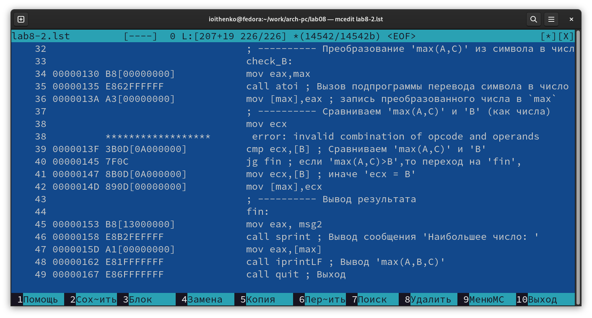

---
## Front matter
title: "Отчёт по лабораторной работе №8"
subtitle: "Дисциплина: Архитектура компьютера"
author: "Ищенко Ирина Олеговна"

## Generic otions
lang: ru-RU
toc-title: "Содержание"

## Bibliography
bibliography: bib/cite.bib
csl: pandoc/csl/gost-r-7-0-5-2008-numeric.csl

## Pdf output format
toc: true # Table of contents
toc-depth: 2
lof: true # List of figures
lot: true # List of tables
fontsize: 12pt
linestretch: 1.5
papersize: a4
documentclass: scrreprt
## I18n polyglossia
polyglossia-lang:
  name: russian
  options:
	- spelling=modern
	- babelshorthands=true
polyglossia-otherlangs:
  name: english
## I18n babel
babel-lang: russian
babel-otherlangs: english
## Fonts
mainfont: PT Serif
romanfont: PT Serif
sansfont: PT Sans
monofont: PT Mono
mainfontoptions: Ligatures=TeX
romanfontoptions: Ligatures=TeX
sansfontoptions: Ligatures=TeX,Scale=MatchLowercase
monofontoptions: Scale=MatchLowercase,Scale=0.9
## Biblatex
biblatex: true
biblio-style: "gost-numeric"
biblatexoptions:
  - parentracker=true
  - backend=biber
  - hyperref=auto
  - language=auto
  - autolang=other*
  - citestyle=gost-numeric
## Pandoc-crossref LaTeX customization
figureTitle: "Рис."
tableTitle: "Таблица"
listingTitle: "Листинг"
lofTitle: "Список иллюстраций"
lotTitle: "Список таблиц"
lolTitle: "Листинги"
## Misc options
indent: true
header-includes:
  - \usepackage{indentfirst}
  - \usepackage{float} # keep figures where there are in the text
  - \floatplacement{figure}{H} # keep figures where there are in the text
---

# Цель работы

Изучение команд условного и безусловного переходов. Приобретение навыков написания программ с использованием переходов. Знакомство с назначением и структурой файла листинга.

# Выполнение лабораторной работы

Создаем каталог для программам лабораторной работы № 8, переходим в
него и создаем файл lab8-1.asm (рис. [-@fig:001]).

{ #fig:001 width=70% }

Введем в файл lab8-1.asm текст программы из листинга 1. Создадим исполняемый файл и запустим его (рис. [-@fig:002]).
Листинг 1:

```nasm
%include 'in_out.asm' ; подключение внешнего файла
SECTION .data
msg1: DB 'Сообщение № 1',0
msg2: DB 'Сообщение № 2',0
msg3: DB 'Сообщение № 3',0
SECTION .text
GLOBAL _start
_start:
jmp _label2
_label1:
mov eax, msg1 ; Вывод на экран строки
call sprintLF ; 'Сообщение № 1'
_label2:
mov eax, msg2 ; Вывод на экран строки
call sprintLF ; 'Сообщение № 2'
_label3:
mov eax, msg3 ; Вывод на экран строки
call sprintLF ; 'Сообщение № 3'
_end:
call quit ; вызов подпрограммы завершения
```

{ #fig:002 width=70% }

Измените текст программы в соответствии с листингом 2. Создадим исполняемый файл и запустим его (рис. [-@fig:003]).

```nasm
%include 'in_out.asm' ; подключение внешнего файла
SECTION .data
msg1: DB 'Сообщение № 1',0
msg2: DB 'Сообщение № 2',0
msg3: DB 'Сообщение № 3',0
SECTION .text
GLOBAL _start
_start:
jmp _label2
_label1:
mov eax, msg1 ; Вывод на экран строки
call sprintLF ; 'Сообщение № 1'
jmp _end
_label2:
mov eax, msg2 ; Вывод на экран строки
call sprintLF ; 'Сообщение № 2'
jmp _label1
_label3:
mov eax, msg3 ; Вывод на экран строки
call sprintLF ; 'Сообщение № 3'
_end:
call quit ; вызов подпрограммы завершения
```

{ #fig:003 width=70% }

В соответствии с листингом 3 изменим текст программы, добавив и изменив инструкции jmp, так чтобы выводилось сначала Сообщение №3, затем Сообщение №2 и в конце Сообщение №1. Проверим работу программы (рис. [-@fig:004]).
Листинг 3:

```nasm
msg3: DB 'Сообщение № 3',0
SECTION .text
GLOBAL _start
_start:
jmp _label3
_label1:
mov eax, msg1 ; Вывод на экран строки
call sprintLF ; 'Сообщение № 1'
jmp _end
_label2:
mov eax, msg2 ; Вывод на экран строки
call sprintLF ; 'Сообщение № 2'
jmp _label1
_label3:
mov eax, msg3 ; Вывод на экран строки
call sprintLF ; 'Сообщение № 3'
jmp _label2
_end:
call quit ; вызов подпрограммы завершения
```

{ #fig:004 width=70% }

Создадим файл lab8-2.asm в каталоге ~/work/arch-pc/lab08. Введем текст программы из листинга 4 в lab8-2.asm. Создадим исполняемый файл и запустим программу (рис. [-@fig:005]) и (рис. [-@fig:006]).
Листинг 4:

```nasm
%include 'in_out.asm'
section .data
msg1 db 'Введите B: ',0h
msg2 db "Наибольшее число: ",0h
A dd '20'
C dd '50'
section .bss
max resb 10
B resb 10
section .text
global _start
_start:
; ---------- Вывод сообщения 'Введите B: '
mov eax,msg1
call sprint
; ---------- Ввод 'B'
mov ecx,B
mov edx,10
call sread
; ---------- Преобразование 'B' из символа в число
mov eax,B
call atoi ; Вызов подпрограммы перевода символа в число
mov [B],eax ; запись преобразованного числа в 'B'
; ---------- Записываем 'A' в переменную 'max'
mov ecx,[A] ; 'ecx = A'
mov [max],ecx ; 'max = A'
; ---------- Сравниваем 'A' и 'С' (как символы)
cmp ecx,[C] ; Сравниваем 'A' и 'С'
jg check_B ; если 'A>C', то переход на метку 'check_B',
mov ecx,[C] ; иначе 'ecx = C'
mov [max],ecx ; 'max = C'
; ---------- Преобразование 'max(A,C)' из символа в число
check_B:
mov eax,max
call atoi ; Вызов подпрограммы перевода символа в число
mov [max],eax ; запись преобразованного числа в `max`
; ---------- Сравниваем 'max(A,C)' и 'B' (как числа)
mov ecx,[max]
cmp ecx,[B] ; Сравниваем 'max(A,C)' и 'B'
jg fin ; если 'max(A,C)>B', то переход на 'fin',
mov ecx,[B] ; иначе 'ecx = B'
mov [max],ecx
; ---------- Вывод результата
fin:
mov eax, msg2
call sprint ; Вывод сообщения 'Наибольшее число: '
mov eax,[max]
call iprintLF ; Вывод 'max(A,B,C)'
call quit ; Выход
```

{ #fig:005 width=70% }

{ #fig:006 width=70% }

Создадим файл листинга для программы из файла lab8-2.asm и откроем его с помощью тексового редактора (рис. [-@fig:007]).

{ #fig:007 width=70% }

Рассмотрим содержимое трех строк из файла листинга:

строка 18:
18 - номер строки
000000F7 - адрес
ВА0А000000 - машинный код
mov edx, 10 - исходный текст программы

строка 19:
19 - номер строки
000000FC - адрес
E842FFFFFF - машинный код
call sread - исходный текст программы

строка 21: 
21 - номер строки
00000101 - адрес
B8[0A000000] - машинный код
mov eax, B - исходный текст программы
 
Откроем файл с программой lab8-2.asm и в любой инструкции с двумя операндами удалим один операнд. Выполним трансляцию с получением файла листинга (рис. [-@fig:008]). Откроем файл листинга (рис. [-@fig:009]). При трансляции файла появляется сообщение об ошибке, создается только файл листинга, в котором также появилось сообщение об ошибке.
 
{ #fig:008 width=70% } 
 
{ #fig:009 width=70% }

# Выполнение заданий для самостоятельной работы

Напишем программу нахождения наименьшей из 3 целочисленных переменных a, b и c (листинг 5). Значения переменных выбрали из варианта 10, в соответствие с лабораторной работой №7. Создадим исполняемый файл и проверим его работу (рис. [-@fig:0010]).
Листинг 5:

```nasm
%include 'in_out.asm'
section .data
msg1 db 'Введите a: ',0h
msg2 db 'Введите b: ',0h
msg3 db 'Введите c: ',0h
msg4 db 'Наименьшее число: ',0h
section .bss
a resb 10
b resb 10
c resb 10
min resb 10

section .text
global _start
_start:

mov eax,msg1
call sprint
mov ecx,a
mov edx,10
call sread
mov eax,a
call atoi
mov [a],eax

mov eax,msg2
call sprint
mov ecx,b
mov edx,10
call sread
mov eax,b
call atoi
mov [b],eax

mov eax,msg3
call sprint
mov ecx,c
mov edx,10
call sread
mov eax,c
call atoi
mov [c],eax

mov ecx,[a]
mov [min],ecx
cmp ecx,[b]
jl check_c
mov ecx,[b]
mov [min],ecx

check_c:
cmp ecx,[c]
jl fin
mov ecx,[c]
mov [min],ecx

fin:
mov eax, msg4
call sprint
mov eax,[min]
call iprintLF
call quit
```

{ #fig:0010 width=70% }

Напишем программу, которая для введенных с клавиатуры значений x и a вычисляет значение функции f(x) из варианта 10 и выводит результат вычислений (листинг 6). Создадим исполняемый файл и проверим его работу (рис. [-@fig:0011]).
Листинг 6:

```nasm
%include 'in_out.asm'
SECTION .data
    msgA:<----->DB 'Введите A: ',0
    msgX:       DB 'Введите X: ',0
    msg: DB 'Результат: ',0

SECTION .bss
    A resb  80
    X resb  80
    result resb 80

SECTION .text
    GLOBAL _start

_start:
    mov eax,msgA
    call sprint
    mov ecx,A
    mov edx,80
    call sread
    mov eax,A
    call atoi
    mov [A],eax

    mov eax,msgX
    call sprint
    mov ecx,X
    mov edx,80
    call sread
    mov eax,X
    call atoi
    mov [X],eax

    mov ebx, [X]
    cmp ebx, 2
    jg first
    jmp second
    mov eax,msg
    call sprint

first:
    mov eax,[X]
    add eax,-2
    call iprintLF
    call quit
second:
    mov eax, [A]
    mov ebx, 3
    mul eax
    call iprintLF
    call quit
```

{ #fig:0011 width=70% }
 
# Выводы

В ходе лабораторной работы я изучила команды условного и безусловного переходов, приобрела навык написания программ с использованием переходов и познакомилась с назначением и структурой файла листинга.

::: {#refs}
:::
