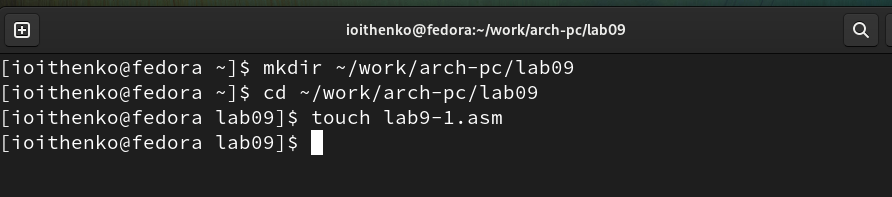
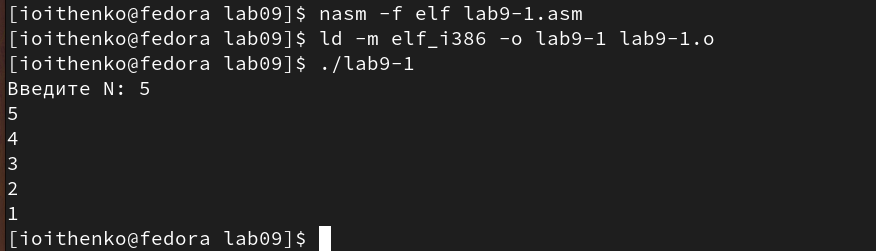
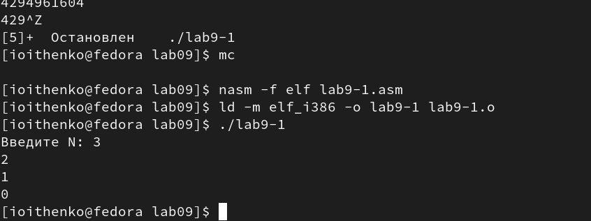
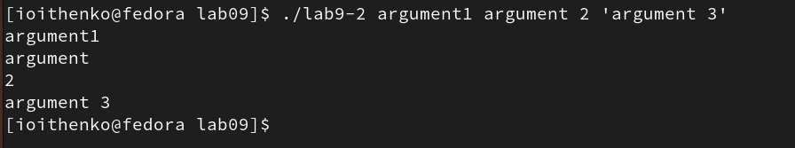
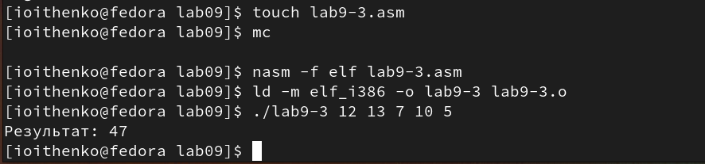
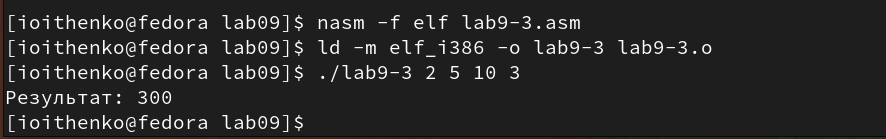
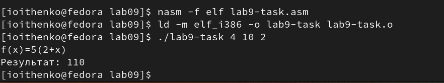

---
## Front matter
title: "Отчёт по лабораторной работе №9"
subtitle: "Дисциплина: Архитектура компьютера"
author: "Ищенко Ирина Олеговна"

## Generic otions
lang: ru-RU
toc-title: "Содержание"

## Bibliography
bibliography: bib/cite.bib
csl: pandoc/csl/gost-r-7-0-5-2008-numeric.csl

## Pdf output format
toc: true # Table of contents
toc-depth: 2
lof: true # List of figures
lot: true # List of tables
fontsize: 12pt
linestretch: 1.5
papersize: a4
documentclass: scrreprt
## I18n polyglossia
polyglossia-lang:
  name: russian
  options:
	- spelling=modern
	- babelshorthands=true
polyglossia-otherlangs:
  name: english
## I18n babel
babel-lang: russian
babel-otherlangs: english
## Fonts
mainfont: PT Serif
romanfont: PT Serif
sansfont: PT Sans
monofont: PT Mono
mainfontoptions: Ligatures=TeX
romanfontoptions: Ligatures=TeX
sansfontoptions: Ligatures=TeX,Scale=MatchLowercase
monofontoptions: Scale=MatchLowercase,Scale=0.9
## Biblatex
biblatex: true
biblio-style: "gost-numeric"
biblatexoptions:
  - parentracker=true
  - backend=biber
  - hyperref=auto
  - language=auto
  - autolang=other*
  - citestyle=gost-numeric
## Pandoc-crossref LaTeX customization
figureTitle: "Рис."
tableTitle: "Таблица"
listingTitle: "Листинг"
lofTitle: "Список иллюстраций"
lotTitle: "Список таблиц"
lolTitle: "Листинги"
## Misc options
indent: true
header-includes:
  - \usepackage{indentfirst}
  - \usepackage{float} # keep figures where there are in the text
  - \floatplacement{figure}{H} # keep figures where there are in the text
---

# Цель работы

Приобретение навыков написания программ с использованием циклов и
обработкой аргументов командной строки.

# Выполнение лабораторной работы

Создаем каталог для программам лабораторной работы № 9, переходим в
него и создаем файл lab9-1.asm (рис. [-@fig:001]).

{ #fig:001 width=70% }

Введем в файл lab9-1.asm текст программы из листинга 1. Создадим исполняемый файл и проверим его работу (рис. [-@fig:002]).
Листинг 1:

```nasm
%include 'in_out.asm'
SECTION .data
msg1 db 'Введите N: ',0h
SECTION .bss
N: resb 10
SECTION .text
global _start
_start:
; ----- Вывод сообщения 'Введите N: '
mov eax,msg1
call sprint
; ----- Ввод 'N'
mov ecx, N
mov edx, 10
call sread
; ----- Преобразование 'N' из символа в число
mov eax,N
call atoi
mov [N],eax
; ------ Организация цикла
mov ecx,[N] ; Счетчик цикла, `ecx=N`
label:
mov [N],ecx
mov eax,[N]
call iprintLF ; Вывод значения `N`
loop label ; `ecx=ecx-1` и если `ecx` не '0'
; переход на `label`
call quit
```

{ #fig:002 width=70% }

Изменим текст программы в соответсвие с листингом 2, добавив изменение значение регистра ecx в цикле. Создадим исполняемый файл и проверим его работу. Программа запускает бесконечный цикл при нечетном N и выводит только нечетные числа при четном N.
Листинг 2:

```nasm
label:
sub ecx,1 ; `ecx=ecx-1`
mov [N],ecx
mov eax,[N]
call iprintLF
loop label
```

Внесем изменения в текст программы по листингу 3, добавив команды push и pop (добавления в стек и извлечения из стека) для сохранения значения счетчика цикла loop (рис. [-@fig:003]). Число проходов цикла соответствует значению N, введенному с клавиатуры, а программа выводит числа от N-1 до 0.
Листинг 3:

```nasm
label:
push ecx ; добавление значения ecx в стек
sub ecx,1
mov [N],ecx
mov eax,[N]
call iprintLF
pop ecx ; извлечение значения ecx из стека
loop label
```

{ #fig:003 width=70% }

Создадим файл lab9-2.asm в каталоге ~/work/arch-pc/lab09 и введем в него
текст программы из листинга 4. Создадим исполняемый файл и запустим его, указав аргументы (рис. [-@fig:004]).
Программа обработала 4 аргумента.
Листинг 4:

```nasm
%include 'in_out.asm'
SECTION .text
global _start
_start:
pop ecx ; Извлекаем из стека в `ecx` количество
; аргументов (первое значение в стеке)
pop edx ; Извлекаем из стека в `edx` имя программы
; (второе значение в стеке)
sub ecx, 1 ; Уменьшаем `ecx` на 1 (количество
; аргументов без названия программы)
next:
cmp ecx, 0 ; проверяем, есть ли еще аргументы
jz _end ; если аргументов нет выходим из цикла
; (переход на метку `_end`)
pop eax ; иначе извлекаем аргумент из стека
call sprintLF ; вызываем функцию печати
loop next ; переход к обработке следующего
; аргумента (переход на метку `next`)
_end:
call quit
```

{ #fig:004 width=70% }

Рассмотрим еще один пример программы которая выводит сумму чисел, которые передаются в программу как аргументы. Создадим файл lab9-3.asm в каталоге ~/work/arch-pc/lab09 и введите в него текст программы из листинга 5. Создадим исполняемый файл и запустим его, указав аргументы (рис. [-@fig:005]).
Листинг 5:

```nasm
%include 'in_out.asm'
SECTION .data
msg db "Результат: ",0
SECTION .text
global _start
_start:
pop ecx ; Извлекаем из стека в `ecx` количество
; аргументов (первое значение в стеке)
pop edx ; Извлекаем из стека в `edx` имя программы
; (второе значение в стеке)
sub ecx,1 ; Уменьшаем `ecx` на 1 (количество
; аргументов без названия программы)
mov esi, 0 ; Используем `esi` для хранения
; промежуточных сумм
next:
cmp ecx,0h ; проверяем, есть ли еще аргументы
jz _end ; если аргументов нет выходим из цикла
; (переход на метку `_end`)
pop eax ; иначе извлекаем следующий аргумент из стека
call atoi ; преобразуем символ в число
add esi,eax ; добавляем к промежуточной сумме
; след. аргумент `esi=esi+eax`
loop next ; переход к обработке следующего аргумента
_end:
mov eax, msg ; вывод сообщения "Результат: "
call sprint
mov eax, esi ; записываем сумму в регистр `eax`
call iprintLF ; печать результата
call quit ; завершение программы
```

{ #fig:005 width=70% }

Изменим текст программы по листингу 6 для вычисления произведения аргументов командной строки (рис. [-@fig:006]).
Листинг 6:

```nasm
%include 'in_out.asm'
SECTION .data
msg db "Результат: ",0
SECTION .text
global _start
_start:
pop ecx ; Извлекаем из стека в `ecx` количество
; аргументов (первое значение в стеке)
pop edx ; Извлекаем из стека в `edx` имя программы
; (второе значение в стеке)
sub ecx,1 ; Уменьшаем `ecx` на 1 (количество
; аргументов без названия программы)
mov esi, 1 ; Используем `esi` для хранения
; промежуточных сумм
next:
cmp ecx,0h ; проверяем, есть ли еще аргументы
jz _end ; если аргументов нет выходим из цикла
; (переход на метку `_end`)
pop eax ; иначе извлекаем следующий аргумент из стека
call atoi ; преобразуем символ в число
mov ebx,eax
mov eax,esi
mul ebx
mov esi,eax
loop next ; переход к обработке следующего аргумента
_end:
mov eax, msg ; вывод сообщения "Результат: "
call sprint
mov eax, esi ; записываем сумму в регистр `eax`
call iprintLF ; печать результата
call quit ; завершение программы
```

{ #fig:006 width=70% }

# Выполнение заданий для самостоятельной работы

Напишем программу (листинг 7), которая находит сумму значений функции (рис. [-@fig:007]). Вариант 10: f(x)=5(2+x)
Листинг 7:

```nasm
%include 'in_out.asm'
SECTION .data
msg db "Результат: ",0
fx: db 'f(x)=5(2+x) ',0

SECTION .text
global _start
_start:
mov eax, fx
call sprintLF
pop ecx 
pop edx
sub ecx,1
mov esi, 0

next:
cmp ecx,0h
jz _end 
pop eax
call atoi
add eax,2
mov ebx,5
mul ebx
add esi,eax

loop next

_end:
mov eax, msg
call sprint
mov eax, esi
call iprintLF
call quit
```

{ #fig:007 width=70% }

# Выводы

В ходе лабораторной работы я приобрела навыки написания программ с использованием циклов и обработки аргументов командной строки.


::: {#refs}
:::
