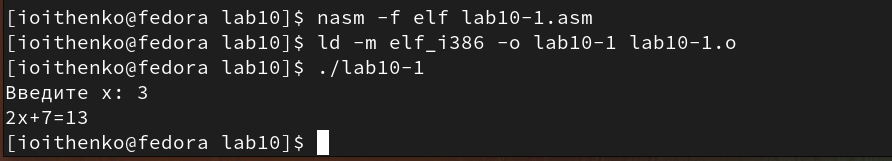
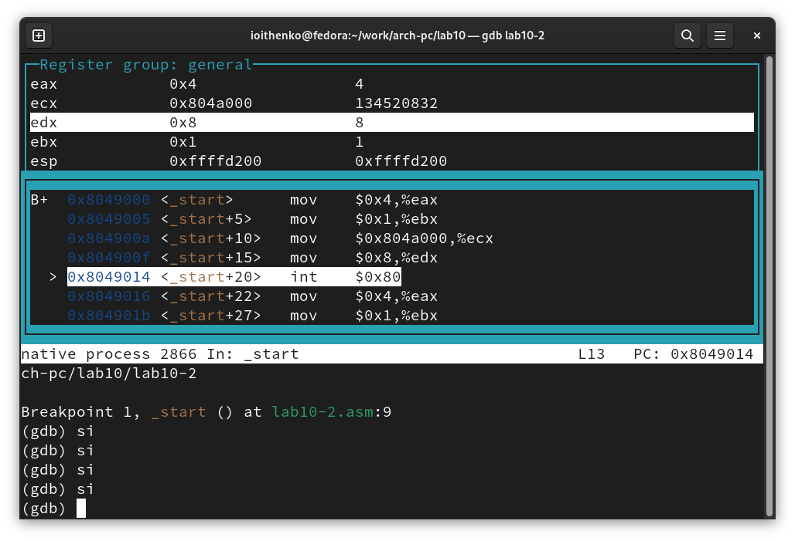
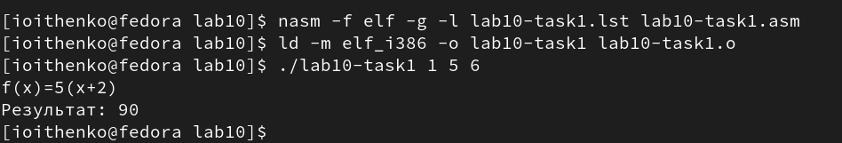

---
## Front matter
title: "Отчет по лабораторной работе №10"
subtitle: "Дисциплина: Архитектура компьютера"
author: "Ищенко Ирина Олеговна"

## Generic otions
lang: ru-RU
toc-title: "Содержание"

## Bibliography
bibliography: bib/cite.bib
csl: pandoc/csl/gost-r-7-0-5-2008-numeric.csl

## Pdf output format
toc: true # Table of contents
toc-depth: 2
lof: true # List of figures
lot: true # List of tables
fontsize: 12pt
linestretch: 1.5
papersize: a4
documentclass: scrreprt
## I18n polyglossia
polyglossia-lang:
  name: russian
  options:
	- spelling=modern
	- babelshorthands=true
polyglossia-otherlangs:
  name: english
## I18n babel
babel-lang: russian
babel-otherlangs: english
## Fonts
mainfont: PT Serif
romanfont: PT Serif
sansfont: PT Sans
monofont: PT Mono
mainfontoptions: Ligatures=TeX
romanfontoptions: Ligatures=TeX
sansfontoptions: Ligatures=TeX,Scale=MatchLowercase
monofontoptions: Scale=MatchLowercase,Scale=0.9
## Biblatex
biblatex: true
biblio-style: "gost-numeric"
biblatexoptions:
  - parentracker=true
  - backend=biber
  - hyperref=auto
  - language=auto
  - autolang=other*
  - citestyle=gost-numeric
## Pandoc-crossref LaTeX customization
figureTitle: "Рис."
tableTitle: "Таблица"
listingTitle: "Листинг"
lofTitle: "Список иллюстраций"
lotTitle: "Список таблиц"
lolTitle: "Листинги"
## Misc options
indent: true
header-includes:
  - \usepackage{indentfirst}
  - \usepackage{float} # keep figures where there are in the text
  - \floatplacement{figure}{H} # keep figures where there are in the text
---

# Цель работы

Приобретение навыков написания программ с использованием подпрограмм.
Знакомство с методами отладки при помощи GDB и его основными возможностями.

# Выполнение лабораторной работы

Создадим каталог для выполнения лабораторной работы № 10, перейдем
в него и создадим файл lab10-1.asm (рис. [-@fig:001]).

{ #fig:001 width=70% }

Введем в файл lab10-1.asm текст программы из листинга 1. Создадим
исполняемый файл и проверим его работу (рис. [-@fig:002]).
Листинг 2:

```nasm
%include 'in_out.asm'
SECTION .data
msg: DB 'Введите x: ',0
result: DB '2x+7=',0
SECTION .bss
x: RESB 80
rezs: RESB 80
SECTION .text
GLOBAL _start
_start:
;------------------------------------------
; Основная программа
;------------------------------------------
mov eax, msg
call sprint
mov ecx, x
mov edx, 80
call sread
mov eax,x
call atoi
call _calcul ; Вызов подпрограммы _calcul
mov eax,result
call sprint
mov eax,[res]
call iprintLF
call quit
;------------------------------------------
; Подпрограмма вычисления
; выражения "2x+7"
_calcul:
mov ebx,2
mul ebx
add eax,7
mov [rez],eax
ret ; выход из подпрограммы
```

{ #fig:002 width=70% }

Изменим текст программы, добавив подпрограмму _subcalcul в подпрограмму _calcul, согласно листингу 2. Создадим исполняемый файл и проверим его работу (рис. [-@fig:003]).
Листинг 2:

```nasm
%include 'in_out.asm'
SECTION .data
msg: DB 'Введите x: ',0
result: DB '2(3x-1)+7=',0

SECTION .bss
x: RESB 80
rez: RESB 80

SECTION .text
GLOBAL _start
_start:
mov eax, msg
call sprint
mov ecx, x
mov edx, 80
call sread
mov eax,x
call atoi
call _calcul ; Вызов подпрограммы _calcul
mov eax,result
call sprint
mov eax,[rez]
call iprintLF
call quit

_calcul:
call _subcalcul
mov ebx,2
mul ebx
add eax,7
mov [rez],eax
ret ; выход из подпрограммы

_subcalcul:
mov ebx,3
mul ebx
sub eax,1
ret
```

{ #fig:003 width=70% }

Создадим файл lab10-2.asm с текстом программы из листинга 3.Получим исполняемый файл. Загрузим исполняемый файл в отладчик gdb (рис. [-@fig:004]). Проверим работу программы, запустив ее в оболочке GDB с помощью команды run (рис. [-@fig:005]).
Листинг 3:

```nasm
SECTION .data
msg1: db "Hello, ",0x0
msg1Len: equ $ - msg1
msg2: db "world!",0xa
msg2Len: equ $ - msg2
SECTION .text
global _start
_start:
mov eax, 4
mov ebx, 1
mov ecx, msg1
mov edx, msg1Len
int 0x80
mov eax, 4
mov ebx, 1
mov ecx, msg2
mov edx, msg2Len
int 0x80
mov eax, 1
mov ebx, 0
int 0x80
```

{ #fig:004 width=70% }

{ #fig:005 width=70% }

Для более подробного анализа программы установим брейкпоинт на метку
_start, с которой начинается выполнение любой ассемблерной программы, и
запустим её (рис. [-@fig:006]).

{ #fig:006 width=70% }

Посмотрим дисассимилированный код программы с помощью команды disassemble начиная с метки _start (рис. [-@fig:007]).

{ #fig:007 width=70% }

Переключимся на отображение команд с Intel’овским синтаксисом, введя
команду set disassembly-flavor intel. Код Intel опускает символ ‘%’ перед именами регистров, инструкции с несколькими операндами перечисляют их в обратном порядке.

Включим режим псевдографики для более удобного анализа программы (рис. [-@fig:008]).

{ #fig:008 width=70% }

Проверим наличие брейкпоинтов с помощью команды info breakpoints и установим еще одну точку останова по адресу инструкции. Адрес инструкции можно увидеть в средней части экрана в левом столбце соответствующей инструкции. Определим адрес предпоследней инструкции (mov ebx,0x0) и установим точку останова. 
Посмотрим информацию о всех установленных точках останова (рис. [-@fig:0010]).

{ #fig:0010 width=70% }

Отладчик может показывать содержимое ячеек памяти и регистров, а при необходимости позволяет вручную изменять значения регистров и переменных. Выполним 5 инструкций с помощью команды stepi (или si) и проследите за изменением значений регистров (рис. [-@fig:0011]), (рис. [-@fig:0012]), (рис. [-@fig:0013]), (рис. [-@fig:0014]) и (рис. [-@fig:0015]). Команда si делает шаг от брейкпоинта и показывает значение регистра согласно строке.

{ #fig:0011 width=70% }

{ #fig:0012 width=70% }

{ #fig:0013 width=70% }

{ #fig:0014 width=70% }

{ #fig:0015 width=70% }

Посмотрим значение переменной msg1 по имени и значение переменной msg2 по адресу (рис. [-@fig:0016]).

{ #fig:0016 width=70% }

Изменим первый символ переменной msg1. Заменим любой символ во второй переменной msg2 (рис. [-@fig:0017]).

{ #fig:0017 width=70% }

Выведем в различных форматах (в шестнадцатеричном формате, в двоичном
формате и в символьном виде) значение регистра edx (рис. [-@fig:0018]).

{ #fig:0018 width=70% }

С помощью команды set изменим значение регистра ebx (рис. [-@fig:0019]).
Разница вывода команда заключается в том, что в первом случае мы вводим 2 как символ.

{ #fig:0019 width=70% }

Завершим выполнение программы с помощью команды continue (сокращенно c) или stepi (сокращенно si) и выйдем из GDB с помощью команды quit (сокращенно q).

Скопируем файл lab9-2.asm, созданный при выполнении лабораторной работы №9, с программой выводящей на экран аргументы командной строки в файл с именем lab10-3.asm. Создадим исполняемый файл. Загрузим исполняемый файл в отладчик, указав аргументы (рис. [-@fig:0020]).

{ #fig:0020 width=70% }

Установим точку брейкпоинта. Посмотрим позиции стека (рис. [-@fig:0021]). Шаг изменения адреса равен 4 ([esp+4], [esp+8], [esp+12] и т.д.), так как шаг равен размеру переменной - 4 байтам.

{ #fig:0021 width=70% }

# Выполнение заданий для самостоятельной работы

Преобразуем программу из лабораторной работы №9 (Задание №1 для
самостоятельной работы), реализовав вычисление значения функции
как подпрограмму, согласно листингу 4 (рис. [-@fig:0022]).
Листинг 4:

```nasm
%include 'in_out.asm'
SECTION .data
msg db "Результат: ",0
fx: db 'f(x)=5(x+2) ',0

SECTION .text
global _start
_start:
mov eax, fx
call sprintLF
pop ecx 
pop edx
sub ecx,1
mov esi, 0

next:
cmp ecx,0h
jz _end 
pop eax
call atoi
call calc
add esi,eax

loop next

_end:
mov eax, msg
call sprint
mov eax, esi
call iprintLF
call quit

calc:
add eax,2
mov ebx,5 
mul ebx
ret
```

{ #fig:0022 width=70% }

В листинге 5 приведена программа вычисления выражения (3+2)*4+5.
При запуске данная программа дает неверный результат. Проверим это (рис. [-@fig:0023]). С помощью отладчика GDB, анализируя изменения значений регистров (рис. [-@fig:0024]), определим ошибку: перепутан порядок аргументов у инструкции add и по окончании работы в edi отправляется регистр ebx вместо eax.
Исправим ее согласно листингу 6 (рис. [-@fig:0025]).
Листинг 5:

```nasm
%include 'in_out.asm'
SECTION .data
div: DB 'Результат: ',0
SECTION .text
GLOBAL _start
_start:
; ---- Вычисление выражения (3+2)*4+5
mov ebx,3
mov eax,2
add ebx,eax
mov ecx,4
mul ecx
add ebx,5
mov edi,ebx
; ---- Вывод результата на экран
mov eax,div
call sprint
mov eax,edi
call iprintLF
call quit
```

{ #fig:0023 width=70% }

{ #fig:0024 width=70% }

Листинг 6:

```nasm
%include 'in_out.asm'
SECTION .data
div: DB 'Результат: ',0
SECTION .text
GLOBAL _start
_start:
; ---- Вычисление выражения (3+2)*4+5
mov ebx,3
mov eax,2
add eax,ebx
mov ecx,4
mul ecx
add eax,5
mov edi,eax
; ---- Вывод результата на экран
mov eax,div
call sprint
mov eax,edi
call iprintLF
call quit
```

{ #fig:0025 width=70% }

# Выводы

В ходе лабораторной работы я приобрела навыки написания программ с использованием подпрограмм и познакомилась с методами отладки при помощи GDB и его основными возможностями.

::: {#refs}
:::
