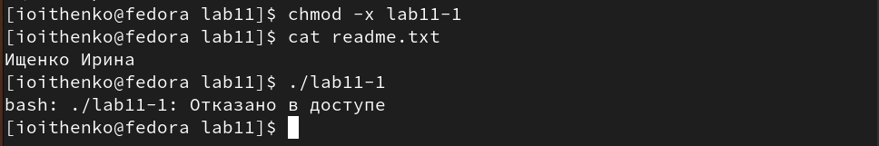

---
## Front matter
title: "Отчёт по лабораторной работе №11"
subtitle: "Дисциплина: Архитектура компьютера"
author: "Ищенко Ирина Олеговна"

## Generic otions
lang: ru-RU
toc-title: "Содержание"

## Bibliography
bibliography: bib/cite.bib
csl: pandoc/csl/gost-r-7-0-5-2008-numeric.csl

## Pdf output format
toc: true # Table of contents
toc-depth: 2
lof: true # List of figures
lot: true # List of tables
fontsize: 12pt
linestretch: 1.5
papersize: a4
documentclass: scrreprt
## I18n polyglossia
polyglossia-lang:
  name: russian
  options:
	- spelling=modern
	- babelshorthands=true
polyglossia-otherlangs:
  name: english
## I18n babel
babel-lang: russian
babel-otherlangs: english
## Fonts
mainfont: PT Serif
romanfont: PT Serif
sansfont: PT Sans
monofont: PT Mono
mainfontoptions: Ligatures=TeX
romanfontoptions: Ligatures=TeX
sansfontoptions: Ligatures=TeX,Scale=MatchLowercase
monofontoptions: Scale=MatchLowercase,Scale=0.9
## Biblatex
biblatex: true
biblio-style: "gost-numeric"
biblatexoptions:
  - parentracker=true
  - backend=biber
  - hyperref=auto
  - language=auto
  - autolang=other*
  - citestyle=gost-numeric
## Pandoc-crossref LaTeX customization
figureTitle: "Рис."
tableTitle: "Таблица"
listingTitle: "Листинг"
lofTitle: "Список иллюстраций"
lotTitle: "Список таблиц"
lolTitle: "Листинги"
## Misc options
indent: true
header-includes:
  - \usepackage{indentfirst}
  - \usepackage{float} # keep figures where there are in the text
  - \floatplacement{figure}{H} # keep figures where there are in the text
---

# Цель работы

Приобретение навыков написания программ для работы с файлами.

# Выполнение лабораторной работы

Создадим каталог для программам лабораторной работы № 11, перейдем в него и создадим файл lab11-1.asm и readme.txt.
Введем в файл lab11-1.asm текст программы из листинга 1. Создадим исполняемый файл и проверим его работу (рис. [-@fig:001]).
Листинг 1:

```nasm
;--------------------------------
; Запись в файл строки введененой на запрос
;--------------------------------
%include 'in_out.asm'
SECTION .data
filename db 'readme.txt', 0h ; Имя файла
msg db 'Введите строку для записи в файл: ', 0h ; Сообщение
SECTION .bss
contents resb 255 ; переменная для вводимой строки
SECTION .text
global _start
_start:
; --- Печать сообщения `msg`
mov eax,msg
call sprint
; ---- Запись введеной с клавиатуры строки в `contents`
mov ecx, contents
mov edx, 255
call sread
; --- Открытие существующего файла (`sys_open`)
mov ecx, 2 ; открываем для записи (2)
mov ebx, filename
mov eax, 5
int 80h
; --- Запись дескриптора файла в `esi`
mov esi, eax
; --- Расчет длины введенной строки
mov eax, contents ; в `eax` запишется количество
call slen ; введенных байтов
; --- Записываем в файл `contents` (`sys_write`)
mov edx, eax
mov ecx, contents
mov ebx, esi
mov eax, 4
int 80h
; --- Закрываем файл (`sys_close`)
mov ebx, esi
mov eax, 6
int 80h
call quit
```

{ #fig:001 width=70% }

С помощью команды chmod изменим права доступа к исполняемому файлу
lab11-1, запретив его выполнение. Попытаемся выполнить файл (рис. [-@fig:002]).
Файл не запускается, поскольку запуск запрещен.

{ #fig:002 width=70% }

С помощью команды chmod изменим права доступа к файлу lab11-1.asm с
исходным текстом программы, добавив права на исполнение (рис. [-@fig:003]).
Файл запускается и терминал пытается выполнить его содержимое как консольные команды.

{ #fig:003 width=70% }

Предоставим права доступа к файлу readme.txt в соответствии с вариантом в таблице. Вариант 10. Проверим правильность выполнения с помощью команды ls -l. (рис. [-@fig:004]).

{ #fig:004 width=70% }

# Выполнение заданий для самостоятельной работы

Напишем программу работающую по следующему алгоритму (листинг 2):
• Вывод приглашения “Как Вас зовут?”
• ввести с клавиатуры свои фамилию и имя
• создать файл с именем name.txt
• записать в файл сообщение “Меня зовут”
• дописать в файл строку введенную с клавиатуры
• закрыть файл
Создадим исполняемый файл и проверим его работу (рис. [-@fig:005]).
Листинг 2:

```nasm
%include 'in_out.asm'
SECTION .data
    msg:	DB 'Как вас зовут? ',0
    filename: DB 'name.txt',0
    my_name: DB 'Меня зовут',0
SECTION .bss
    X:	RESB 80

SECTION .text
    GLOBAL _start

_start:

    mov eax,msg
    call sprint

    mov ecx,X
    mov edx,80
    call sread

    mov ecx, 0777o
    mov ebx, filename
    mov eax, 8
    int 80h
 
    mov esi, eax 

    mov eax, my_name
    call slen 

    mov edx, eax 
    mov ecx, my_name
    mov ebx, esi 
    mov eax, 4
    int 80h 

    mov ebx, esi 
    mov eax, 6 
    int 80h

    mov ecx,1 
    mov ebx, filename 
    mov eax, 5
    int 80h 

    mov esi, eax  
   
    mov edx, 2 
    mov ecx,0
    mov ebx, eax 
    mov eax, 19 
    int 80h 
    

    mov eax, X
    call slen 
   
    mov edx,eax 
    mov ecx, X 
    mov ebx, esi 
    mov eax, 4
    int 80h

    mov ebx, esi 
    mov eax, 6 
    int 80h 
    


    call quit
```

{ #fig:005 width=70% }

# Выводы

В ходе лабораторной работы я приобрела навыки написания программ для работы с файлами.

::: {#refs}
:::
